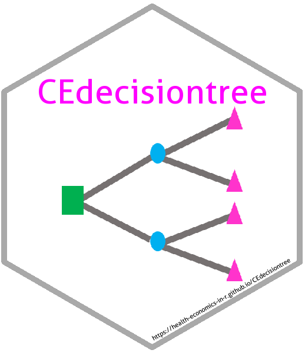
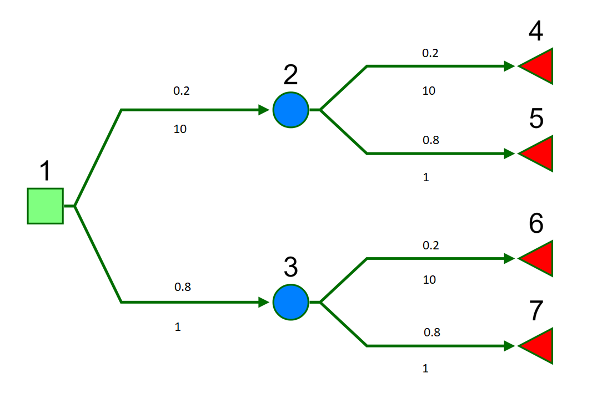

# CEdecisiontree 

<!-- badges: start -->
[](https://github.com/Health-Economics-in-R/CEdecisiontree/actions)
[](https://codecov.io/github/Health-Economics-in-R/CEdecisiontree?branch=master)
[](http://github.com/badges/stability-badges)
<!-- badges: end -->


<!-- README.md is generated from README.Rmd. Please edit that file -->

```{r setup, include = FALSE}
knitr::opts_chunk$set(
  collapse = TRUE,
  comment = "#>",
  fig.path = "man/figures/README-",
  out.width = "100%",
  tidy = FALSE,
  error = FALSE,
  fig.width = 5,
  fig.height = 5
)
```

> An R package for lightweight cost-effectiveness analysis using decision trees.

Requests and comments welcome; please use [Issues](https://github.com/n8thangreen/CEdecisiontree/issues).


## Installing CEdecisiontree

To install the development version from github:
```{r eval=FALSE}
library(remotes)
install_github("Health-Economics-in-R/CEdecisiontree")
```

Then, to load the package, use:
```{r eval=FALSE}
library(CEdecisiontree)
```


## Motivation

Decisions trees can be modelled as special cases of more general models using available packages in R e.g. heemod, mstate or msm.
Further, full probability models could be fit using a Bayesian model with e.g. Stan, jags or WinBUGS.
However, simple decision tree models are often built in Excel, using statistics from literature or expert knowledge. 
This package is a analogue to these, such that  models can be specified in a very similar and simple way.

## Calculation

A decision tree is defined by parent-child pairs, i.e. from-to connections, and the probability and associated value (e.g. cost) of traversing each of the connections.
Denote the probability of transitioning from node $i$ to $j$ as $p_{ij}$ and the cost attributable to node $i$ as $c_i$.
Where no connection exists between two nodes we shall say that the parent's set of children is the empty set $\emptyset$.
Denote the set of children by $child(\cdot)$.
Clearly, there are no $p_{ij}$ or $c_j$ in this case but for computational purposes we will assume that $p_{ij} = NA$ and $c_j = 0$.

The expected value at each node $i \in S$ is calculated by 'folding back' using the recursive formula

$$
\hat{c}_i = c_i + \sum_{j \in child(i)} p_{ij} \hat{c}_j
$$

with boundary values at the terminal nodes

$$\hat{c}_i = c_i \mbox{ for } i = \{ S: child(s) = \emptyset \}.$$


## Basic example

Quietly load libraries.
```{r message=FALSE, warning=FALSE}
library(CEdecisiontree)
library(readr)
library(dplyr)
library(reshape2)
library(tidyr)
library(assertthat)
```

We will consider a simple 7 node binary tree.
Numeric labels are shown above each node.
Probabilities and costs are show above and below each branch, respectively.

```{r, echo=FALSE, out.width = "400px"}
# 
knitr::include_graphics("https://raw.githubusercontent.com/Health-Economics-in-R/CEdecisiontree/dev/man/figures/README_decisiontree_silverdecisions.png")
```

So if we were to write out the expected cost in full this would give
$$p_{12}(c_{12} + p_{24}c_{24} + p_{25}c_{25}) + p_{13}(c_{13} + p_{36}c_{36} + p_{37}c_{37})$$

Load example data from the package. 
```{r}
data("cost")
data("probs")
```

The cost and probability matrices we will use in this example are sparse arrays indicating the edge values (rows=from node, columns=to node).
There are therefore the same dimensions and have the same entry pattern. Empty cells have `NA`.
```{r}
cost
```

```{r}
probs
```

`probs` is a probability transition matrix.
This is like `pmatrix.msm` in the `msm` package, or `define_transition` in the `heemod` package.

The `transMat()` function in the `mstate` package creates a closely related multi-state model transition matrix.
Copying this package, we can create a decision tree transition matrix to use with this.

```{r}
CEdecisiontree:::trans_binarytree(depth = 3)
```


The expected value at each node is calculate as follows.
```{r}
my_model <-
  define_model(
    transmat = list(vals = cost,
                    prob = probs))

dectree_expected_values(model = my_model)
```

There is also an Rcpp version of this function.
```{r eval = FALSE}
Cdectree_expected_values(vals = as.matrix(cost),
                         p = as.matrix(probs))
```


## Other tree statistics

For additional information, including for the purposes of model checking we can calculate other tree statistics.
We can obtain the contributing cost as weighted by the chance of occurrence.
This can be thought of as a trade-off between the raw, original cost and branch position.

```{r}
wcost <- branch_joint_probs(my_model) * cost
wcost
```

We can check that this sums to the same total expected cost.
```{r}
sum(wcost, na.rm = TRUE)
```

We can also calculate the joint probabilities of traversing to each terminal state using `branch_joint_probs`.
This is useful when an alternative model set-up is used such that total costs and health values are assigned to these terminal nodes only.
Here we assume node labelling order from root such that terminal nodes are last.

```{r}
n_from_nodes <- nrow(probs)
n_to_nodes <- ncol(probs)
terminal_states <- (n_from_nodes + 1):n_to_nodes

p_terminal_state <-
  branch_joint_probs(my_model)[ ,terminal_states] %>%
  colSums(na.rm = TRUE)

p_terminal_state
sum(p_terminal_state)
```

See package [vignettes](https://health-economics-in-r.github.io/CEdecisiontree/articles/) for more details and examples.

## Code of Conduct

Please note that the CEdecisiontree project is released with a [Contributor Code of Conduct](https://contributor-covenant.org/version/2/0/CODE_OF_CONDUCT.html).
By contributing to this project, you agree to abide by its terms.

## License

[](https://www.gnu.org/licenses/gpl-3.0)
