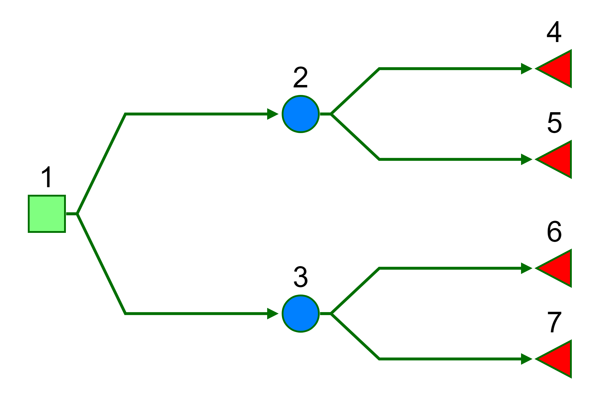

[](https://travis-ci.org/n8thangreen/CEdecisiontree)
[](https://ci.appveyor.com/project/n8thangreen/CEdecisiontree)
[](https://codecov.io/github/n8thangreen/CEdecisiontree?branch=master)
[](http://github.com/badges/stability-badges)


<!-- README.md is generated from README.Rmd. Please edit that file -->

```{r setup, include = FALSE}
knitr::opts_chunk$set(
  collapse = TRUE,
  comment = "#>",
  fig.path = "man/figures/README-",
  out.width = "100%",
  tidy = FALSE,
  error = FALSE,
  fig.width = 5,
  fig.height = 5
)
```
# CEdecisiontree

An R package for lightweight cost-effectiveness analysis using decision trees.

Currently contains functions to:

- matrix (wide, sparse) representation

## To do
Request welcome; please use [Issues](https://github.com/n8thangreen/CEdecisiontree/issues)

- fully integrate src


## Installing CEdecisiontree

To install the development version from github:
```{r eval=FALSE}
library(devtools)
install_github("n8thangreen/CEdecisiontree")
```

Then, to load the package, use:
```{r eval=FALSE}
library(CEdecisiontree)
```


## Motivation
Full probabilty models could be fit using a Bayesian model with e.g. jags or WinBUGS but when all values are statistics from literature or expert knowledge a simple, direct model is often built in Excel. This is a analogue to these.


## Basic example

Quietly load libraries.
```{r}
suppressWarnings(suppressMessages(library(CEdecisiontree)))
suppressWarnings(suppressMessages(library(readr)))
suppressWarnings(suppressMessages(library(dplyr)))
suppressWarnings(suppressMessages(library(reshape2)))
suppressWarnings(suppressMessages(library(tidyr)))
```

We will consider a simple 7 node binary tree.

```{r, echo=FALSE, out.width = "400px"}

```


Load example data from the package. 
```{r}
data("cost")
data("probs")
```

The cost and probability matrices we will use in this example are sparse arrays indicating the edge values (rows=from node, columns=to node).
There are therefore the same dimensions and have the same entry pattern. Empty cells have `NA`.
```{r}
cost
```

```{r}
probs
```

`probs` is a probability transition matrix.
This is like `pmatrix.msm` in the `msm` package, or `define_transition` in the `heemod` package.
The `transMat()` function in the `mstate` package creates a closely related multi-state model transition matrix. Copying this, we can do

```{r}
CEdecisiontree:::trans_binarytree(depth = 3)
```


The expected value at each node is calculate as follows.
```{r}
dectree_expected_values(vals = cost,
                        p = probs)
```

There is also an Rcpp version of this function.
```{r}
Cdectree_expected_values(vals = as.matrix(cost),
                         p = as.matrix(probs))
```


## Long arrays

Clearly, as the size of the tree increased the sparse matrix become impractical. We can provide a long format array to address this. Let us transform the wide array used previously to demonstrate the structure and space saving.
```{r}
probs_long <-
  probs %>%
  mutate('from' = rownames(.)) %>%
  melt(id.vars = "from",
       variable.name = 'to',
       value.name = 'prob') %>%
  na.omit()

cost_long <-
  cost %>%
  mutate('from' = rownames(.)) %>%
  melt(id.vars = "from",
       variable.name = 'to',
       value.name = 'cost') %>%
  na.omit()

merge(probs_long,
      cost_long)
```


## Other tree statistics
For additional information, inclusing for the purposes of model checking we can calculate other tree statistics.
We can obtain the contributing cost as weighted by the chance of occurrence. This can be thought of as a trade-off between the raw, original cost and branch position.

```{r}
wcost <- branch_joint_probs(probs) * cost
wcost
```

We can check that this sums to the same total expected cost.
```{r}
sum(wcost, na.rm = TRUE)
```

We can also calculate the joint probabilities of traversing to each terminal state using `branch_joint_probs`.
Here we assume node labelling order from root such that terminal nodes are last.

```{r}
n_from_nodes <- nrow(probs)
n_to_nodes <- ncol(probs)
terminal_states <- (n_from_nodes + 1):n_to_nodes

p_terminal_state <-
  branch_joint_probs(probs)[ ,terminal_states] %>%
  colSums(na.rm = TRUE)

p_terminal_state
sum(p_terminal_state)
```

## Comparison with `heemod` 

```{r}
library(heemod)

mat_base <- define_transition(
  state_names = as.character(1:8),
  0, 0.2, 0.8,0,0,0,0,0, 
  0,0,0, 0.2, 0.8,0,0,0,  
  0,0,0,0,0, 0.2, 0.8,0,
  0,0,0,0,0,0,0,1,
  0,0,0,0,0,0,0,1,
  0,0,0,0,0,0,0,1,
  0,0,0,0,0,0,0,1,
  0,0,0,0,0,0,0,1
)
```


Define cost at each node:
```{r}
state_1 <- define_state(
  cost_total = 0,
  qaly = 0)

state_2 <- define_state(
  cost_total = 10,
  qaly = 1)

state_3 <- define_state(
  cost_total = 1,
  qaly = 1)

state_4 <- define_state(
  cost_total = 10,
  qaly = 1)

state_5 <- define_state(
  cost_total = 1,
  qaly = 1)

state_6 <- define_state(
  cost_total = 10,
  qaly = 1)

state_7 <- define_state(
  cost_total = 1,
  qaly = 1)

state_8 <- define_state(
  cost_total = 0,
  qaly = 0)

strat_base <- define_strategy(
  transition = mat_base,
  "1" = state_1,
  "2" = state_2,
  "3" = state_3,
  "4" = state_4,
  "5" = state_5,
  "6" = state_6,
  "7" = state_7,
  "8" = state_8
)
```

Finally, we get the expected cost 
```{r}
run_model(
  strat_base,
  cycles = 100,
  cost = cost_total,
  effect = qaly)
```


See package [vignette](http://htmlpreview.github.io/?https://github.com/n8thangreen/CEdecisiontree/blob/master/inst/doc/vignette_main.html) for more details and examples.

## License

GPL-3 © 
