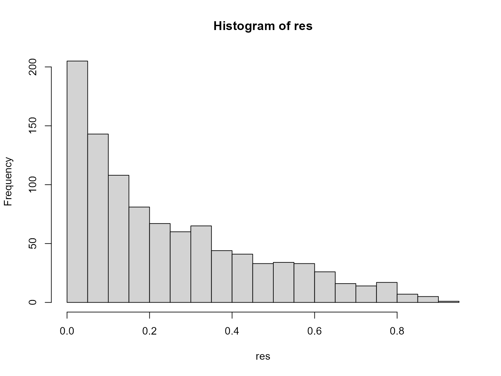

<div id="main" class="col-md-9" role="main">

# Probability Sensitivity Analysis (PSA)

<div class="section level2">

## Introduction

Probability Sensitivity Analysis (PSA) is a core part of any
cost-effectiveness analysis (Briggs et al. 2012). Here, we will carry
this out for a simple decision tree. This involves repeatedly sampling
from a distribution for each branch probability and cost and calculating
the total expected value for each set of realisations.

</div>

<div class="section level2">

## Example

Load the required packages.

<div id="cb1" class="sourceCode">

``` r
library(CEdecisiontree, quietly = TRUE)
library(assertthat, quietly = TRUE)
library(tibble, quietly = TRUE)
library(tidyverse, quietly = TRUE)
library(purrr, quietly = TRUE)
```

</div>

We first define the decision tree. The difference to previous trees is
that we now use
[*list-columns*](https://r4ds.had.co.nz/many-models.html) to define
distributions rather than point values. Also, notice that we do not
specify distributions for all of the probabilities. We only need to
sepcify a distribution for one of the two branches and this will also
ensure that they will sum to one as necessary.

<div id="cb2" class="sourceCode">

``` r
tree_dat <-
  list(child = list("1" = c(2, 3),
                    "2" = NULL,
                    "3" = NULL),
       dat = tibble(
         node = 1:3,
         prob =
           list(
             NA_real_,
             NA,
             # list(distn = "unif", params = c(min = 0, max = 1)),
             list(distn = "unif", params = c(min = 0, max = 1))),
         vals =
           list(
             0L,
             list(distn = "unif", params = c(min = 0, max = 1)),
             list(distn = "unif", params = c(min = 0, max = 1)))))

tree_dat
#> $child
#> $child$`1`
#> [1] 2 3
#> 
#> $child$`2`
#> NULL
#> 
#> $child$`3`
#> NULL
#> 
#> 
#> $dat
#> # A tibble: 3 × 3
#>    node prob             vals            
#>   <int> <list>           <list>          
#> 1     1 <dbl [1]>        <int [1]>       
#> 2     2 <lgl [1]>        <named list [2]>
#> 3     3 <named list [2]> <named list [2]>
```

</div>

Fill missing complementary probabilities

<div id="cb3" class="sourceCode">

``` r
##TODO:
fill_complementary_probs(tree_dat$dat)
```

</div>

We can now loop over this tree and generate samples of values for the
given distributions. We use the `sample_distributions()` function to do
this. This is all wrapped up in the convenience function
`create_psa_inputs()`.

<div id="cb4" class="sourceCode">

``` r
tree_dat_sa <- create_psa_inputs(tree_dat, n = 1000)
```

</div>

This results in a list of trees.

<div id="cb5" class="sourceCode">

``` r
head(tree_dat_sa, 2)
#> [[1]]
#> $child
#> $child$`1`
#> [1] 2 3
#> 
#> $child$`2`
#> NULL
#> 
#> $child$`3`
#> NULL
#> 
#> 
#> $dat
#>   node       prob      vals
#> 1    1         NA 0.0000000
#> 2    2         NA 0.8343330
#> 3    3 0.08075014 0.6007609
#> 
#> attr(,"class")
#> [1] "tree_dat" "list"    
#> 
#> [[2]]
#> $child
#> $child$`1`
#> [1] 2 3
#> 
#> $child$`2`
#> NULL
#> 
#> $child$`3`
#> NULL
#> 
#> 
#> $dat
#>   node      prob        vals
#> 1    1        NA 0.000000000
#> 2    2        NA 0.007399441
#> 3    3 0.1572084 0.466393497
#> 
#> attr(,"class")
#> [1] "tree_dat" "list"
```

</div>

Doing this explicitly can be a good idea because we can save and reuse
the same random sample input data. Now, it is straightforward to map (or
loop) over each of these trees to obtain the total expected values.

<div id="cb6" class="sourceCode">

``` r
# # a single run
# res1 <- dectree_expected_values(tree_dat_sa[[1]])

res <- map_dbl(tree_dat_sa, ~dectree_expected_values(.)[1])
head(res)
#> [1] 0.04851152 0.07332099 0.36481208 0.13514540 0.01377626 0.01245663
```

</div>

We see from the associated histogram that the expected total value is

<div id="cb7" class="sourceCode">

``` r
hist(res, breaks = 20)
```

</div>



For simplicity, we have also provided a single wrapper function to
perform these two steps.

<div id="cb8" class="sourceCode">

``` r
res <- dectree_expected_psa(tree_dat, n = 1000)
```

</div>

</div>

<div class="section level2 unnumbered">

## References

<div id="refs" class="references csl-bib-body hanging-indent">

<div id="ref-Briggs2012" class="csl-entry">

Briggs, Andrew H, Milton C Weinstein, Elisabeth AL Fenwick, Jonathan
Karnon, Mark J Sculpher, and A David Paltiel. 2012. “Model Parameter
Estimation and Uncertainty: A Report of the ISPOR-SMDM Modeling Good
Research Practices Task Force-6 on Behalf of the ISPOR-SMDM Modeling
Good Research Practices Task Force Background to the Task Force.” *Value
in Health 15* 15: 835–42. <https://doi.org/10.1016/j.jval.2012.04.014>.

</div>

</div>

</div>

</div>
